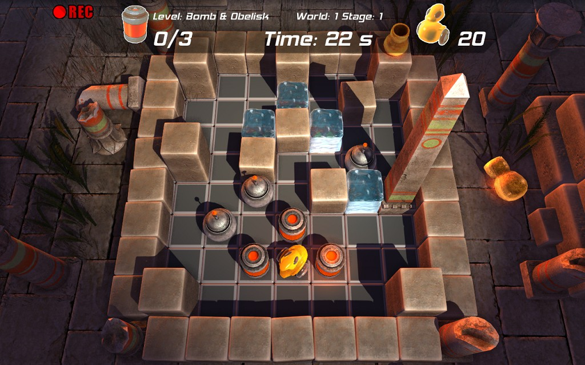

# Mr.Cleaner, Adventures in Time.

Mr.Cleaner, Adventures in Time. 49 levels of Sokoban with 3D graphics ! An Indie Game by [AndyGFX](https://github.com/AndyGFX) &amp; [Astrofra](https://github.com/astrofra).  
Implemented in [Squirrel](https://github.com/albertodemichelis/squirrel), based on [GameStart 3D](https://www.youtube.com/@GameStart3D/videos) engine by [Emmanuel Julien](https://github.com/ejulien/).

## Story

In a distant future, a scientific experiment goes awry, dispersing radioactive shells through time. To avert disaster, a robot named Mr. Cleaner is sent across different eras to retrieve these dangerous items and prevent catastrophic radiation poisoning.

## Features

- **49 Original Sokoban Puzzles:** Spread across 7 levels in 7 different historical eras including the Stone Age, Ancient Egypt, the Middle Ages, and a Distant Future.
- **High-Quality Graphics:** Features complex shaders, realtime shadows, and volumetric atmosphere rendering.
- **Dynamic Audio:** Encompasses 20 music tracks across a broad range of styles.

## How to Play

Control Mr. Cleaner using simple commands:
- **Rotate Left/Right:** Left, Right Arrow Keys
- **Move Forward:** Up Arrow Key
- **Rotate Camera:** CTRL + Arrow Key
- **Activate Bomb:** Space Bar
- **Main Menu:** Esc

## Minimum Hardware Requirements

- **Graphics Card:** NVidia GeForce series 8000 or ATI Radeon series 3000 (Note: Intel graphic chips may cause the game to crash.)
